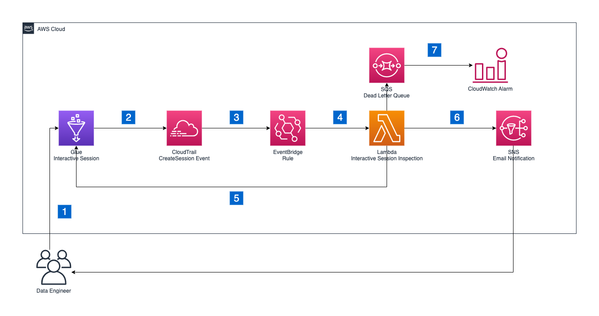

# Enforce Boundaries on Glue Interactive Sessions
In this repository you will find the code to deploy all the resources to enforce
controls on [Glue Interactive Sessions](https://docs.aws.amazon.com/glue/latest/dg/interactive-sessions.html).

## Description

Glue Interactive Sessions allows engineers to build, test and run data preparation and analytics workload in an interactive notebook. Interactive sessions provide isolated development environments, takes care of the underlying compute cluster and allows for configuration to stop idling resources. While interactive sessions come with default configuration, engineers can override options to customise the session to their needs. For example, provisioning more workers to experiment on a larger dataset or setting the idle timeout for long running workloads.

The controls defined here will terminate all the AWS Glue interactive based on the configuration to enforce Glue connections in vpc, maximum amount of workers and maixmum idle timeout.
In addition will send an email to a user's specified address to alert regarding the termination.

## Architecture

The proposed architecture is built on serverless components and is executed event-driven whenever a new glue interactive session is created.



1. Data engineer creates a new Glue Interactive Session either through the AWS Management Console or in a Jupyter Notebook locally.
2. Glue Interactive Session will produce a new event toAWS [CloudTrail](https://docs.aws.amazon.com/awscloudtrail/latest/userguide/cloudtrail-user-guide.html) for the CreateSession event with all relevant information to identify and inspect a session as soon as the session is initiated.
3. An Amazon EventBridge rule filters the CloudTrail events and invokes the AWS Lambda function to inspect the CreateSession event.
4. The Interactive Session Inspection function will inspect the CreateSession event and will check for all defined boundary conditions. Currently, the solution supports configuration for the *maximum number of workers*, *idle timeout* in minutes and *deployment with* *connection* enforced.
5. If any of the defined boundary conditions are not met, for example too many workers are provisioned for the session, depending on the provided configuration the function will terminate the Glue Interactive Session immediately, will send an email via [Amazon Simple Notification Service](https://aws.amazon.com/sns/) or both. In case the session is not started yet, the function will wait for it to start before terminating.
6. In case the session was terminated, an e-mail is sent to an [Amazon Simple Notification Service](https://aws.amazon.com/sns/) topic. There is no information available in the Glue Interactive Session notebook on the reason for the termination of the session. Therefore, through the SNS topic additional context information is provided to the data engineers.
7. In case the function fails, the sessions are logged in a [dead letter queue](https://docs.aws.amazon.com/AWSSimpleQueueService/latest/SQSDeveloperGuide/sqs-dead-letter-queues.html) inside [Amazon Simple Queue]Service (https://aws.amazon.com/sqs/). Furthermore, the queue is monitored and in case of a message it will trigger an [Amazon CloudWatch](https://aws.amazon.com/cloudwatch/) alarm.


## Walkthrough

### Repository Structure

```shell
cfn/template.yaml # Cloud Formation Template
src/functions # Lambda function and its library
test/ # unittest for lambda function
README.md # this readme file
requirements.txt # list of python library used from the solution and its tests
Makefile # List of tasks to conveniently install, build, deploy and delete the solution.
```

### Pre-requisites

- python > 3.9
- [AWS CLI](https://docs.aws.amazon.com/cli/latest/userguide/cli-chap-welcome.html)
- [SAM CLI](https://docs.aws.amazon.com/serverless-application-model/latest/developerguide/serverless-sam-cli-install-linux.html)
- [Make](https://opensource.com/article/18/8/what-how-makefile)

### Overview of the deployed resources

All the necessary resources are defined in one [AWS CloudFormation](https://aws.amazon.com/cloudformation/getting-started/) file located under `cfn/template.yaml`.

To deploy those resources we will use [AWS Serverless Application Model](https://aws.amazon.com/serverless/sam/) (SAM), which will enable us to conventiently build and package all the dependencies and will also manage CloudFormation steps for us.

Following the main resources deployed by the CloudFormation Stack:

- One [AWS Lambda](https://docs.aws.amazon.com/lambda/latest/dg/welcome.html) function with its library, both defined under the directory `src/functions`. The function is the control. It will validate that the session is started in a VPC and in case will terminate it.
- One [Amanzon Event Rule](https://aws.amazon.com/eventbridge/). This event will listen to [AWS CloudTrail](https://aws.amazon.com/cloudtrail/) and in case of a new glue interactive session started will trigger the control lambda.
- One [Amazon SQS](https://aws.amazon.com/sqs/) Dead Letter Queue (DLQ) attached to the lambda function. Will keep record of events that triggered a lambda failure
- Two [Amazon Cloud Watch Alarms](https://aws.amazon.com/cloudwatch/) monitoring the lambda failures and the messages in the DLQ.

Optionally 2 more resources will be deployed:

- One SNS topic
- One SNS Email subscription

In addition to previously defined resource, CloudFormation will also deploy all the necessary roles and policies plus one [AWS KMS](https://aws.amazon.com/kms/getting-started/) key to ensure that the exchanged data is encrypted.

### Usage

To facilitate deployment lifecycle, included the setup of the user local environment, we are providing a `Makefile` where are described all the necessary steps.

1. **Ensure** to have AWS credential renewed and access to your account.<br>How to do that is documented [here](https://docs.aws.amazon.com/cli/latest/userguide/cli-configure-files.html)
2. **Explore** the `Makefile` and adapt to your needs the AWS Region and the Stack name by modifying the variables `AWS_REGION` and `STACK_NAME`.
3. **Set** a value for `KILL_SESSION = "True"` if you want to terminate immediately the Glue Interactive    Session which has been found out of boundaries.<br>Allowed values: `"True"||"False"`, default to `"True"`
4. **Set** a value for `NOTIFICATION_EMAIL_ADDRESS = <your.email@provider.com>` in the `Makefile` if you want get notified when a session has been found out of boundaries.
5. **Install** all the prerequisites libraries:
    ```shell
    make install-pre-requisites
    ```
    These will be installed under a newly created python virtual environment inside this repository in the directory `.venv`
6. **Deploy** the new stack
    ```shell
    make deploy
    ```
    This command will:
   1. **check** if the pre-requisites are satisfied
   2. **perform** pytest unittest on the python files
   3. **validate** the CloudFormation template
   4. **build** the artefacts (Lambda)
   5. **deploy** the resource via SAM.

### Clean Up

Clean up the deployed resource by running when finished with your tests
```shell
make clean-up
```

## Troubleshooting

In case the python3.9 is not an option and the previous commands are exiting with error mentioning python3.9 is missing, one solution would be to enable `sam build`by using [Docker](https://www.docker.com/).

As an example, you can change the line:
```bash
# sam build -t cfn/template.yaml ->
sam build --use-container -t cfn/template.yaml
```

For more information regarding **sam build with docker** please follow the official documentation [here](https://docs.aws.amazon.com/serverless-application-model/latest/developerguide/sam-cli-command-reference-sam-build.html)

## License

This library is licensed under the MIT-0 License. See the LICENSE file.
